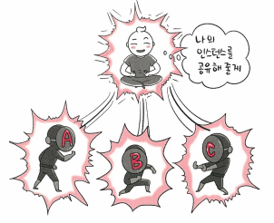
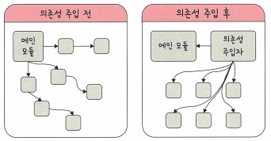
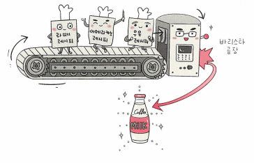
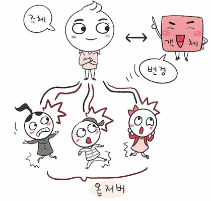
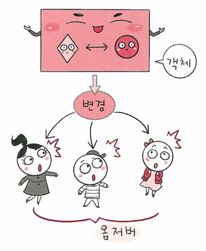
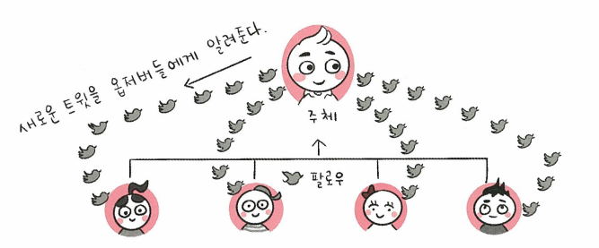
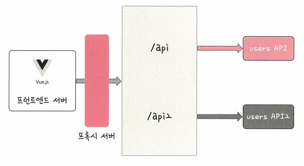

# 디자인 패턴이란..
- 라이브러리/프레임워크의 기본이 되는 것.
- 프로그램을 설계할 때 발생했던 문제점들을 객체 간의 상호 관계 등을 이용해 해결할 수 있도록 하나의 '규약' 형태로 만들어 놓은 것.

# 디자인 패턴의 종류
## 1. 싱글톤 패턴

### 정의와 특징
- 하나의 클래스에 오직 하나의 인스턴스만 가지는 패턴
- 주로 데이터베이스 연결 모듈에 많이 사용함
- Node.js에서 MongoDB를 연결할 때 쓰는 mongoose모듈에서, 그리고 MySQL에 DB를 연결할 때 볼 수 있음


### 장단점
- 장점: 인스턴스 생성 비용을 아낄 수 있음
- 단점: TDD(Test Driven Development)를 할 때 걸림돌이 됨. 단위 테스트는 서로 독립적이어 하는데 싱글톤은 하나의 인스턴스를 기반으로 구현하는 패턴이므로 독립적인 인스턴스를 만들기 어려움


### 의존성 주입 (DI, Dependency Injection)

#### 의존성 주입의 필요성
- 싱글톤 패턴은 사용하기 쉽고 실용적이지만 모듈 간의 결합을 강하게 만들 수 있음(단점)
- 위 단점을 극복하기 위해 의존성 주입을 통해 모듈 간의 결합을 조금 더 느슨하게 만들어 해결할 수 있음
- 의존성 주입은 의존성 주입 원칙을 지키며 만들어야 함. 상위 모듈은 하위 모듈에서 어떠한 것도 가져오지 않아야 함. 둘 다 추상화에 의존해야 하며 이때 추상화는 세부 사항에 의존하지 말아야 함

#### 의존성 주입의 장단점
##### 장점
- 모듈을 쉽게 교체할 수 있는 구조로 만듬
- 마이그레이션하기 수월해짐
- 구현할 때 추상화 레이어를 넣고 이를 기반으로 구현체를 넣어 주기 때문에 앱의 의존성 방향이 일관되고, 앱을 쉽게 추론할 수 있고, 모듈 간의 관계들이 더 명확해짐
##### 단점
- 모듈들이 더 분리되므로 클래스 수가 늘어나 복잡성이 증가될 수 있어 런타임 페널티가 생기기도 함

## 2. 팩토리 패턴

### 정의와 특징
- 객체 생성에 관한 구체적인 부분은 하위 클래스에서, 중요한 뼈대는 상위 클래스에서 결정하는 패턴
- 상위 클래스에서는 인스턴스 생성 방식에 대해 전혀 알 필요가 없기 때문에 더 많은 유연성을 가짐

## 3. 전략 패턴

### 정의와 특징
- 정책 패턴이라고도 함
- 객체의 행위를 바꾸고 싶은 경우 직접 수정학지 않고 전략이라고 부르는 캡슐화한 알고리즘을 컨텐스트 안에서 바꿔주면서 상호 교체가 가능하게 만드는 패턴
### passport의 전략 패턴
- 전략 패턴을 활용한 라이브러리 passport
- Node.js에서 인증 모듈을 구현할 때 쓰는 미들웨어 라이브러리
- '전략'만 바꿔서 인증하는 기능을 구현하게 해줌

## 4. 옵저버 패턴


### 정의와 특징
- 주체가 어떤 객체의 상태 변화를 관찰하다가(주체와 객체가 합쳐진 경우도 있음) 상태 변화가 있을 때마다 메서드 등을 통해 옵저버 목록에 있는 옵저버들에게 변화를 알려주는 디자인 패턴
- 대표적으로 트위터가 옵저버 패턴을 이용

- 옵저버 패턴은 주로 이벤트 기반 시스템에서 사용하고, MVC 패턴에도 사용됨
- MVC 패턴에서는 모델에 변경사항이 생겨 ```update()``` 메서드로 옵저번인 뷰에 알려주고 이를 기반으로 컨트롤러가 작동하는 식

### 자바의 상속과 구현
#### 상속 (extends)
- 상속은 자식 클래스가 부모 클래스의 메서드 등을 상속받아 사용
- 자식 클래스에서 상속받은 것을 확장 및 새로운 것을 추가 가능
- 재사용성이 좋아지고 중복성을 최소화함
- 상속은 일반 클래스, abstract 클래스를 기반으로 구현
#### 구현 (implements)
- 구현은 부모 인터페이스를 자식 클래스에서 재정의해 구현하는 것
- 상속과 달리 반드시 부모 클래스의 메서드를 재정의해 구현해야 함
- 구현은 인터페이스 기반으로 구현

#### 프록시 객체란...
- 프록시 객체는 어떠한 대상의 기본적인 동작의 작업을 가로챌 수 있는 객체를 뜻함
- 자바스크립트에서 프록시 객체는 두 개의 매개변수를 가짐 (target, handler)

## 5. 프록시 패턴
### 정의와 특징
- 대상 객체에 접근하기 전 그 접근에 대한 흐름을 가로채 대상 객체의 앞단의 인터페이스 역할을 하는 디자인 패턴
- 객체의 속성, 변환 등을 보완하며 보안, 데이터 검증, 캐싱, 로깅에 사용

### 프록시 서버란...
- 프록시 서버는 서버와 클라이언트 사이에서 클라이언트가 자신을 통해 다른 네트워크 서비스에 간접적으로 접속할 수 있게 해주는 컴퓨터 시스템이나 응용 프로그램을 가리킴

#### CORS와 프론트엔드 프록시 서버
- CORS는 서버가 웹 브라우저에서 리소스를 로드할 때 다른 오리진을 통해 로드하지 못하게 하는 HTTP 헤더 기반 메커니즘
- 프론트엔드 개발 시 프론트엔드 서버를 만들어 백엔드 서벙와 통신할 때 CORS 에러를 마주치는데, 이를 해결하기 위해 프론트엔드에서 프록시 서버를 만들기도 함


## 6. 이터레이터 패턴
### 정의와 특징
- 이터레이터를 사용해 컬렉션의 요소들에 접근하는 디자인 패턴
- 이를 통해 순회할 수 있는 여러 자료형의 구조와는 상관없이 이터레이터(이터레이터 프로토콜)라는 하나의 인터페이스로 순회 가능

## 7. 노출모듈 패턴
### 정의와 특징
- 즉시 실행 함수를 통해 private, public 같은 접근 제어자를 만드는 패턴
- public: 클래스에 정의된 함수에서 접근 가능하며 자식 클래스와 외부 클래스에서 접근 가능한 범위
- protected: 클래스에 정의된 함수에서 접근 가능, 자식 클래스에서 접근 가능하지만 외부 클래스에서 접근 불가능한 범위
- private: 클래스에 정의된 함수에서 접근 가능하지만 자식 클래스와 외부 클래스에서 접근 불가능한 범위
- 즉시 실행 함수: 함수를 정의하자마자 바로 호출하는 함수. 초기화 코드, 라이브러리 내 전역 변수의 충돌 방지 등에 사용

## 8. MVC 패턴

### 정의와 특징
- Model, View, Controller로 이루어진 디자인 패턴
#### 모델
- 앱의 데이터인 데이터베이스, 상수, 변수 등을 뜻함
#### 뷰
- 사용자 인터페이스 요소를 나타냄
#### 컨트롤러
- 하나 이상의 모델과 하나 이상의 뷰를 잇는 다리 역할
- 이벤트의 메인 로직

## 9. MVP 패턴
- MVC 패턴에서 파생됨
- P는 Presenter
- 뷰와 프리젠터는 1:1관계로 MVC 패턴보다 더 강한 결합을 지닌 디자인 패턴

## 10. MVVM 패턴
- MVC의 C가 View Model로 바뀐 패턴
- 뷰모델은 뷰를 더 추상화한 계층