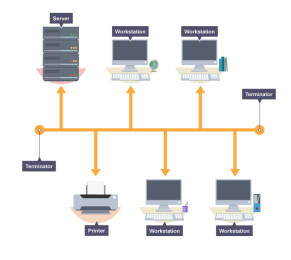
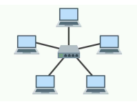
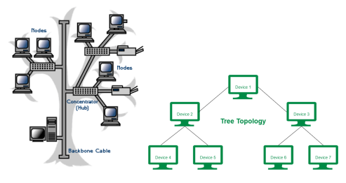
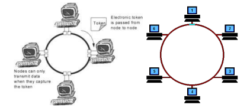
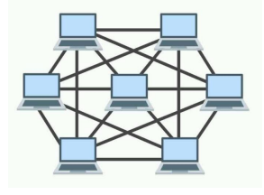

# 1. 네트워크, 처리량, 트래픽, 대역폭, RTT
## 네트워크
- 네트워크란 노드와 링크가 서로 연결되어 있으며 리소스를 공유하는 집합을 의미
- 노드 : 서버, 라우터, 스위치 등 네트워크 장치
- 링크(엣지) : 유선 또는 무선과 같은 연결매체 (와이파이, LAN)

## 트래픽
- 트래픽은 특정시점에 링크 내의 “흐르는” 데이터의 양
- 서버에 저장된파일(문서,이미지,동영상 등)을 클라이언트(사용자)가 다운로드 시 발생되는 데이터의 누적량
  - 트래픽이 많아졌다. = 흐르는 데이터가 많아졌다
  - 처리량이 많아졌다. = 처리되는 트래픽이 많아졌다

## 처리량
- 처리량(throughput)은 링크 내에서 성공적으로 전달된 데이터의 양
- 보통 얼만큼의 트래픽을 처리했는지를 나타냄
  - 많은 트래픽을 처리한다 = 많은 처리량을 가진다.
- 단위 : bps(bits per second)
  - 초당 전송 또는 수신되는 비트 수
- 처리량은 사용자들이 많이 접속할 때마다 커지는 트래픽, 네트워크 장치 간의 대역폭, 네트워크 중간에 발생하는 에러, 장치의 하드웨어 스펙에 영향을 받음

## 대역폭
- 대역폭(bandwidth)은 주어진 시간 동안 네트워크 연결을 통해 흐를 수 있는 최대 비트 수
- 최대로 처리할 수 있는 트래픽
- 대역폭이 높을수록 사용자에게 빠른 서비스를 제공 할 수 있음
  - 대략적인 최대동시접속자수를 유추하는데의 척도가 됨

## RTT
- RTT(Round Trip Time : 왕복 지연시간)는 신호를 전송하고 해당 신호의 수신확인에 걸린 시간을 더한 값
- 어떤 메시지가 두 장치 사이를 왕복하는 데 걸린 시간

---
# 2. 네트워크 토폴로지 : 버스, 스타, 트리, 링, 메시
## 네트워크 토폴로지
- 네트워크 토폴로지란 노드와 링크가 어떻게 구성되어있는지

## 버스 토폴로지

### 특징
- 하나의 회선에 여러개의 노드
- 노드 추가, 삭제 쉬움
- 설치비용 적음
### 장점
- 소규모 네트워크를 구축하기 매우 쉬움.
- 한 노드에 장애가 발생해도 다른 노드에 영향X
### 단점
- 메인 링크에 많은 트래픽이 생기면 정체현상 발생가능성 높음.(패킷 손실율 높음)
- 메인 링크 망가지면 큰 문제

## 스타 토폴로지

### 특징
- 중앙에 있는 노드를 기반으로 연결된 형태
- 노드 추가, 삭제 쉬움
### 장점
- 중앙노드가 아닌 한 노드에 장애가 발생해도 다른 노드에 영향X
- 안정성이 높음.
  - 중앙노드가 아닌 한 노드에 침해가 발생했을 때 다른 노드로 확장하기가 어렵기 때문. 다른 노드로 가려면 중앙노드를 무조건 거쳐야 하고 보통의 스타토폴로지는 중앙노드의 방화벽 등을 더욱 깐깐하게 해놓음.
- 한 링크에 문제가 생겨도 해당 부분만 영향을 받고 나머지 부분은 정상적으로 작동함.
### 단점
- 중앙노드 에러시 큰 문제

## 트리 토폴로지

### 특징
- 트리형태(계층적 토폴로지라고도 함)
- 노드 추가, 삭제 보통(리프노드를 기반으로 확장은 용이하지만 다른 노드는 어려움)
- 버스 토폴로지와 스타토폴로지의 하이브리드 형태
### 장점
- 노드 확장이 용이(주로 리프노드로 확장함)
- 리프노드의 에러는 나머지 부분에 영향을 미치지 않음
### 단점
- 특정 노드 트래픽 집중시 하위노드에 영향
- 루트노드에 문제가 생기면 전체네트워크에 큰 문제

## 링형 토폴로지

### 특징
- 고리형태
- 노드 추가, 삭제가 쉬움
### 장점
- 노드 수가 많아져도 데이터 손실이 없음.
  - 토큰을 기반으로 연속적으로 노드를 거치며 통신권한 여부를 따지고 해당 권한이 없는 노드는 데이터를 전달받지 않음.
### 단점
- 링크 또는 노드가 하나만 에러 발생해도 전체 네트워크에 영향
- 토큰이 없는 노드는 통신에 참여를 못하며 데이터 공유가 안됨.

## 메시 토폴로지

### 특징
- 그물망 형태
- 노드 추가, 삭제 어려움
- 풀(full)메시 토폴로지의 경우 n*(n-1)/2의 회선이 필요함.
### 장점
- 안정성이 높음. 한 노드가 장애가 나도 다른 노드에 영향을 미치지 않음
- 트래픽을 분산할 수 있음.
### 단점
- 회선이 비효율적으로 많기 때문에 구축비용이 고가임

---
# 3. 네트워크 토폴로지의 필요성과 병목현상
## 토폴로지의 필요성
- 토폴로지를 파악함으로써 병목현상을 해결하는 척도가 됨.
## 병목현상
- 병목(bottleneck) 현상은 여러가지 의미로 쓰이나 네트워크에서는 트래픽에 의해 데이터 흐름이 제한되는 상황을 말함. 일명 핫스팟이라고도 합니다.
## 해결 사례
구축된 시스템의 토폴로지를 알고 있다면 어떠한 부분에 어떠한 회선 또는 어떠한 서버의 용량을 증가시켜야하는지 알 수 있음.

---
# 4. 유니캐스트, 멀티캐스
## 유니캐스트
- 1:1통신
- 대표적으로 HTTP통신
- 가장 일반적인 네트워크 전송 형태
## 멀티캐스트
- 1:N 통신
- 연결된 모든 노드들에게 데이터를 전달하지는 않고 특정 그룹에게만 데이터를 전달
## 브로드캐스트
- 1:N 통신입니다
- 그룹이 아닌 연결되어있는 모든 노드에게 데이터를 전달
- ARP(Address Resolution Protocal)