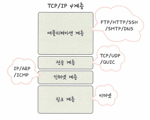

# 1. 개념, 캡슐화/비캡슐화, PDU, OSI 7계층
## TCP/IP 4계층의 개념

- TCP/IP 4계층은 장치들이 인터넷 상에서 데이터를 주고받을 때 쓰는 독립적인 프로토콜의 집합
- TCP(Transmission Control Protocal), IP(Internet Protocal)
- 인터넷을 사용할 때 주로 TCP와 IP를 이용해서 보냄

### 애플리케이션 계층 (application)
- HTTP, SMTP, SSH, FTP가 대표적이며 웹 서비스, 이메일 등 서비스를 실질적으로 사람들에게 제공하는 층

### 전송 계층 (transport)
- TCP, UDP가 대표적이며 애플리케이션계층에서 받은 메시지를 기반으로 세그먼트 또는 데이터그램으로 데이터를 쪼개고 데이터가 오류없이 순서대로 전달되도록 도움을 주는 층

### 인터넷 계층 (network)
- IP, ICMP, ARP가 대표적이며 한 노드에서 다른 노드로 전송 계층에서 받은 세그먼트 또는 데이터그램을 패킷화 하여 목적지로 전송하는 역할

### 링크 계층 (link)
- 링크 계층은 전선, 광섬유, 무선 등으로 데이터가 네트워크를 통해 물리적으로 전송되는 방식을 정의합니다. 데이터링크계층과 물리계층을 합친 계층

## 캡슐화와 비캡슐화
- 캡슐화(encapsulation)
  - 송신자가 수신자에게 데이터를 보낼 때 데이터가 각 계층을 지나며 각 계층의 특징들이 담긴 헤더들이 붙여지는 과정
  - 예를 들어 전송계층은 TCP 헤더, 네트워크 계층은 IP 주소 헤더를 추가하는 것

- 비캡슐화(decapsulation)
  - 캡슐화의 역과정
  - 수신자측에서는 이렇게 캡슐화된 데이터를 역순으로 제거하면서 응용계층까지 도달하는 것

## PDU (Protocal Data Unit)
- PDU는 제어 관련 정보들이 포함된 헤더, 데이터를 의미하는 페이로드로 구성됨
- 애플리케이션 계층: 메시지
- 전송 계층: 세그먼트(TCP), 데이터그램(UDP)
- 인터넷 계층: 패킷
- 링크 계층: 프레임(데이터 링크 계층), 비트(물리 계층)

