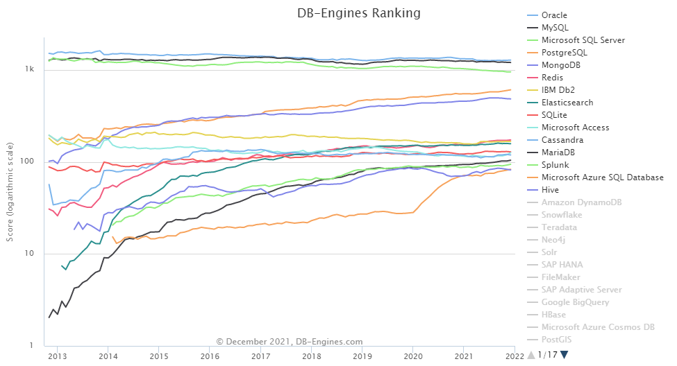

# DB 종류

## DB 종류가 많아진 배경
- 과거에는 대기업 프로젝트에서 오라클을 쓰는 것이 국룰이었나봄. 비싼만큼 가장 안정적인 DB였기 때문.
- 하지만 빅데이터가 대세가 되면서 로그 데이터, 센서 데이터까지 비싼 오라클에 보관할 필요가 없다고 시장이 반응함.

## 그래서 지금 시장 점유율은?

## 1. Oracle
- 미국 오라클 사의 RDBMS(관계형 데이터베이스 관리 시스템)
- 오픈소스 DBMS가 있음에도 안정성과 유지보수를 보장받을 수 있다는 장점 때문에 비 IT업종 기업에서 많이 사용함
- 기업용으로 주로 사용
- 대량의 정보를 관리할 때 타 DBMS보다 좋은 성능을 보임
- 오라클 자체 SQL 쿼리를 사용해 표준 형식과 약간 다름

## 2. MySQL
- RDBMS
- 오픈 소스(무료), 다중 사용자와 다중 스레드 지원
- 표준 SQL 형식 사용
- 오픈 소스이기 때문에 기술 지원의 한계가 있음

## 3. MS-SQL
- 미국 마이크로소프트에서 개발한 RDBMS
- Windows OS 호환성이 좋음
- 중앙 집중식 데이터
- .Net 언어 구현에만 초첨을 맞춰 설계됨
  - .Net 언어란?
    - 마이크로소프트에서 개발한 Windows 프로그램 개발 및 실행 환경(프레임워크).
    - 주요 지원 언어: C#, Visual Basic .NET, C++, DLR(Python, Ruby 등 동적 언어들을 돌리기 위함), F#(GPU 연산), Q#(양자 알고리즘), Delphi.NET

## 4. PostgreSQL
- ORDBMS(객체-관계형 DBMS)
- 오픈소스(그럼에도 상용 RDBMS급 기능을 제공)
- 북미, 일본에서 많이 사용
- 기본적인 CRUD 성능이 경쟁 DB에 비해 좋지 않음.

## 5. MongoDB
- document DB(크로스 플랫폼 도큐먼트 지향 DBMS)
- NoSQL DB
  - NoSQL이란?
    - Not Only SQL (SQL만을 사용하지 않는 DBMS)
    - 관계형 데이터베이스를 사용하지 않는다는 의미가 아닌, 여러 유형의 데이터베이스를 사용하는 것
    - 모든 데이터가 JSON 형태로 저장, 스키마가 없음
    - 다양한 인덱싱 제공
    - 일관성이 매우 중요한 작업에는 사용하기 힘듬

## 6. Redis
- Remote Dictionary Server
- 키-값 구조의 비정형 데이터를 저장하고 관리하기 위한 DBMS
- 오픈소스
- 모든 데이터를 메모리로 불러와서 처리하는 메모리 기반 DBMS (속도가 빠르고 간편)

## 7. SQLite
- 독립형 파일 기반의 오픈소스 RDBMS
- 구글 안드로이드 운영체제에 기본 탑재된 데이터베이스
- 매우 가벼움 (600kb 미만의 공간을 차지)
- 완전한 독립형 (SQlite가 작동하기 위해 시스템에 설치해야 하는 외부 종속성이 없음)
- 이식성이 좋음
- 동시성의 제한, 사용자 관리 존재의 부재, 서버리스 데이터베이스이기에 보안이 약함

## 8. MariaDB
- 오픈 소스 RDBMS
- MySQL과 동일한 소스코드를 기반 (MySQL과 거의 100% 호환)
- MySQL의 개발진이 오라클 정책이 추구하는 바와 맞지 않아 나와서 개발한 DB
- MySQL에 비해 애플리케이션 부분 속도가 4~5천배 빠르고, 성능면에서는 70% 향상을 보인다고 함
- 좀 더 자유로운 MySQL이라고 생각할 수 있음