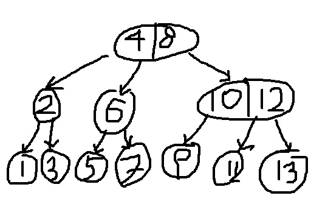
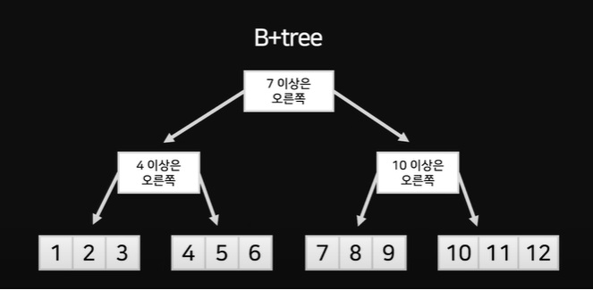

### 인덱스(Index)란?
  - 1부터 100까지 숫자 중 임의의 숫자 하나를 찾는다고 할 때 어떻게 해야 할까?
  - 무식한 방법: 1부터 100까지 하나씩 모두 검사하는 방법
  - 시간이 오래 걸림, 최악의 경우 1부터 100까지 모두 다 비교해야 하는 경우가 있을 수 있다.
  - 똑똑한 방법: 가운데 숫자를 가지고 해당 숫자랑 비교했을 때 찾고자 하는 숫자가 큰지 작은지 비교 -> 이분 탐색(Binary Search의 기본 개념)
  - 이 방식은 1부터 1억까지의 숫자가 있더라도 30번 이내 비교로 찾을 수 있다.
  - 조건: 데이터가 미리 정렬되어 있어야 한다.
  - 실제 데이터는 순서대로 정렬이 되지 않는 경우가 많아서 내가 찾고자 하는 데이터를 찾을 때는 해당 컬럼을 복사한 복사 사본을 만든다. -> 이게 index

### 인덱스 구현
  - Ex) [6, 1, 4, 3, 7, 5, 2] 라는 데이터가 있다고 가정
  - 정렬하면 [1, 2, 3, 4, 5, 6, 7] 가 된다.
  - 컴퓨터에서 자료를 정리하는 방법: Array, Linked List 자료형에 정리해서 담는 방법이 있다.
  - 실제로는 데이터를 tree 형태로 만든다. (가운데 값인 4가 정점)
  - 이렇게 배치해놔도 절반씩 소거하면서 찾을 수 있다.
  - 자료는 트리 형태로 배치해놓는다.

### B tree
  - 하나의 노드에 데이터를 두 개 이상씩 담는다.
  
  - 위와 같이 만들어 놓으면 두 번만의 탐색에 모든 수를 탐색할 수 있다.

### B+tree
  - 
  - 데이터를 노드의 맨 밑에만 보관해준다.
  - 위에 있는 노드들에는 데이터 탐색 가이드만 있다.
  - b+tree의 다른 점은 제일 아래 노드끼리도 연결을 해준다.
  - 아래 노드끼리 연결하면 뭐가 좋음?
    - range(범위) 검색에 매우 좋다.

### 컴퓨터가 DB에서 인덱스를 탐색하는 원리
  - 명령: age = 20인 record 찾아라
  - index가 없는 경우
    - 모든 행을 다 뒤짐
  - index가 있는 경우
    1. index에서 age = 20을 빠르게 찾는다.
    2. index와 연결된 원래 테이블 행을 가져옴

### 인덱스를 만들 때 주의할 점
  - 인덱스를 만들면 원본 배열을 복사한 데이터를 정렬하기 때문에 메모리를 차지한다.
  - 따라서 꼭 필요한 컬럼이 아니면 굳이 인덱스를 만들지 않는다.
  - 원본 데이터가 수정되면 -> 인덱스에도 반영해줘야 함(추가로 작업이 들어가는 이슈로 인해 성능 하락의 이슈가 발생)
  - DB에서 primary_key(기본 키)는 정렬이 되어 있다. (clustered key라고 함)